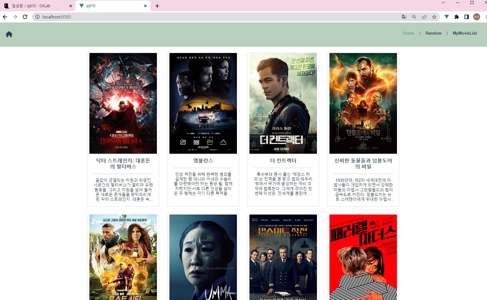
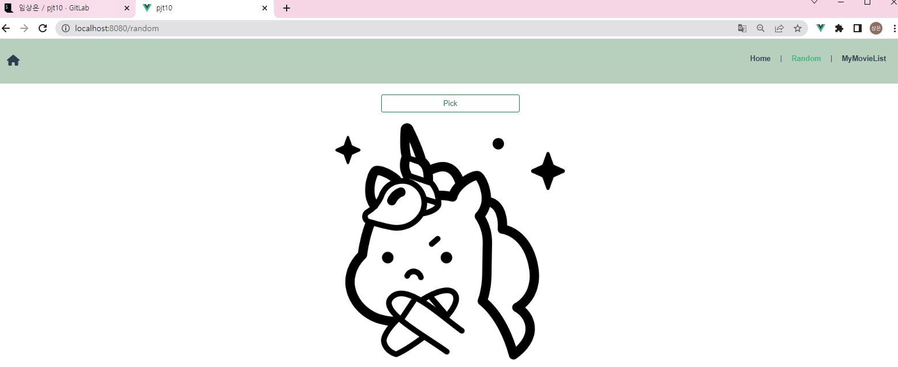
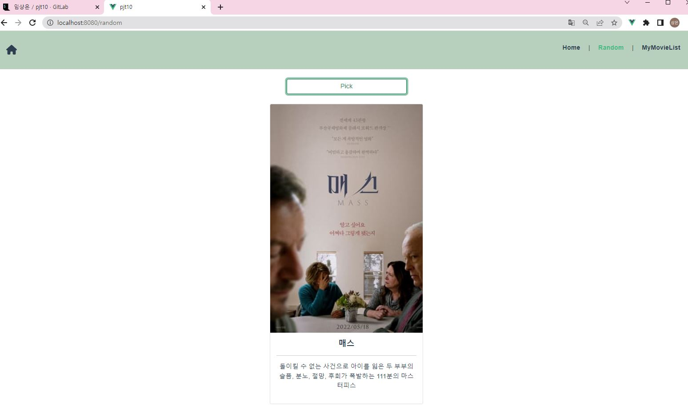
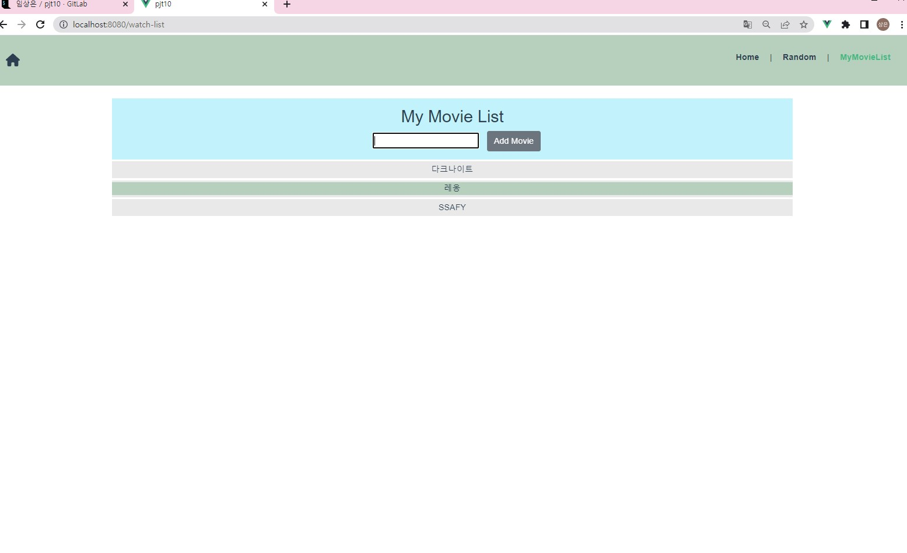

# PJT10 (2022-05-13)

1. vue 프로젝트 생성 및 폴더 이동

   ```
   vue create pjt10 
   cd pjt10
   ```

2. router & vuex 설치

   ```
   vue add router
   vue add vuex
   ```

3. AJAX 통신을 위해 axios 설치 및 서버 실행

   ```
   npm i axios
   npm run serve
   ```

4. 기초 명세 틀 잡기

   - views 폴더에 `HomeView.vue`, `RandomView.vue`, `WatchListView.vue` 컴포넌트 생성 및 기초 틀 잡기
   - components 폴더에 `MovieCard.vue`, `WatchListForm.vue`, `WatchListItem.vue` 컴포넌트 생성 및 기초 틀 잡기

5. router폴더의 index.js 틀 잡기

   ```js
   import Vue from 'vue'
   import VueRouter from 'vue-router'
   import HomeView from '../views/HomeView.vue'
   import RandomView from '../views/RandomView.vue'
   import WatchListView from '../views/WatchListView.vue'
   
   Vue.use(VueRouter)
   
   const routes = [
     {
       path: '/',
       name: 'home',
       component: HomeView
     },
     {
       path: '/random',
       name: 'random',
       component: RandomView
     },
     {
       path: '/watch-list',
       name: 'watch-list',
       component : WatchListView
     },
   ]
   
   const router = new VueRouter({
     mode: 'history',
     base: process.env.BASE_URL,
     routes
   })
   
   export default router6.
   ```
   
6. App.vue의 router-link 수정

   ```vue
   <template>
     <div id="app">
       <nav>
         <div >
           <router-link to="/">Home</router-link> |
           <router-link to="/random">Random</router-link> |
           <router-link to="/watch-list">MyMovieList</router-link>
         </div>
       </nav>
       <router-view/>
     </div>
   </template>
   ```

7. WatchListForm.vue 작성하기 (객체 생성 , actions로 넘기기, 및 css 꾸미기)

   ```vue
   <template>
     <div>
       <input type="text" v-model.trim='movieTitle' @keyup.enter='createMovie' class="mx-3">
       <button @click='createMovie' class="btn btn-secondary">Add Movie</button>
     </div>
   </template>
   
   <script>
   export default {
     name: 'WatchListForm',
     data() {
       return {
         movieTitle: '',
       }
     },
     methods : {
       // movie 객체의 생성
       createMovie () {
         const movieItem = {
           title : this.movieTitle,
           data: new Date().getTime()
         }
         // if 오른쪽 유효성 검사 
         if (movieItem.title){
           this.$store.dispatch('createMovie', movieItem)
         }
         // 사이클 끝난 후 초기화
         this.movieTitle = ''
       } 
     }
   }
   </script>
   
   <style>
   
   </style>
   ```

8. WatchListForm.vue에서 넘겨준 것을 받을 store 폴더의 index.js 작성하기

   ```js
   import Vue from 'vue'
   import Vuex from 'vuex'
   import axios from 'axios'
   
   Vue.use(Vuex)
   
   export default new Vuex.Store({
     state: {
       movieData: [],
       movies: []
     },
   
     getters: {
   
     },
   
     mutations: {
       CREATE_MOVIE(state, movieItem){
         state.movies.push(movieItem)
       },
   
     },
   
     actions: {
       createMovie({commit}, movieItem) {
         commit('CREATE_MOVIE', movieItem)
       },
   
     },
     modules: {
     }
   })
   
   ```
   
9. WatchListView.vue 작성 및 css 꾸미기
   
   ```vue
   <template>
   <div class="container">
     <div class="bg-info bg-opacity-25 py-3">
       <h2>My Movie List</h2>
       <watch-list-form></watch-list-form>
     </div>
     <watch-list-item 
       v-for='movie in movies'
       :key='movie.date'
       :movie='movie'
       ></watch-list-item>
   </div>
   </template>
   
   <script>
   import WatchListForm from '@/components/WatchListForm.vue'
   import WatchListItem from '@/components/WatchListItem.vue'
   
   export default {
     name: 'WatchListView',
     components: {
       WatchListForm,
       WatchListItem,
     },
     computed: {
       movies() {
         return this.$store.state.movies
       }
     }
   }
   </script>
   
   <style>
   
   </style>
   ```
   
10. WatchListItem.vue에 props 가져오기 및 컴포넌트 작성 및 css 작성

    ```vue
    <template>
      <div class="bg-dark bg-opacity-10 my-1 py-1">
        <div id="abc" @click='deleteMovie'>{{ movie.title }}</div>
      </div>
    </template>
    
    <script>
    export default {
      name: 'WatchListItem',
      props: {
        movie: Object,
      },
      methods: {
        deleteMovie(){
          this.$store.dispatch('deleteMovie', this.movie)
        },
      }
    }
    </script>
    
    <style>
      #abc:hover {
        cursor: pointer;
        background-color: rgb(183, 207, 189);
      }
    </style>
    ```

11. store 폴더의 index.js 수정

    ```js
    import Vue from 'vue'
    import Vuex from 'vuex'
    import axios from 'axios'
    
    Vue.use(Vuex)
    
    export default new Vuex.Store({
      state: {
        movieData: [],
        movies: []
      },
    
      getters: {
    
      },
    
      mutations: {
        CREATE_MOVIE(state, movieItem){
          state.movies.push(movieItem)
        },
        DELETE_MOVIE(state, movieItem){
          const index = state.movies.indexOf(movieItem)
          state.movies.splice(index,1)
        },
    
    
      actions: {
        createMovie({commit}, movieItem) {
          commit('CREATE_MOVIE', movieItem)
        },
    
        deleteMovie({commit}, movieItem){
          commit('DELETE_MOVIE', movieItem)
        },
    
      modules: {
      }
    })
    
    ```

12. Homeview.vue 작성 및 css 꾸미기

    ```vue
    <template>
    <div class="d-flex justify-content-center">
      <div class="col-8 d-flex justify-content-center g-3">
        <div class="row d-flex justify-content-center g-3">
          <movie-card class="mx-3 my-3"
          v-for="movie in movieData" 
          :key="movie.id"
          :movie='movie'
          ></movie-card>
        </div>
      </div>
    </div>
    </template>
    
    <script>
    import MovieCard from '@/components/MovieCard.vue'
    
    export default {
      name: 'HomeView',
      components: {
        MovieCard,
      },
      created () {
        this.$store.dispatch('createMovieData')
      },
      computed: {
        movieData() {
          return this.$store.state.movieData
        }
      }
    }
    </script>
    
    <style>
    
    </style>
    ```
13. store 폴더의 index.js 파일에서 axios를 이용해 데이터 가져오는 부분 추가

    ```js
    import Vue from 'vue'
    import Vuex from 'vuex'
    import axios from 'axios'
    // import _ from 'lodash'
    
    Vue.use(Vuex)
    
    export default new Vuex.Store({
      state: {
        movieData: [],
        movies: []
      },
    
      getters: {
        // randomMovie (state) {
        //   return _.sampleSize(state.movieData, 1)[0]
        // }
      },
    
      mutations: {
        CREATE_MOVIE(state, movieItem){
          state.movies.push(movieItem)
        },
        DELETE_MOVIE(state, movieItem){
          const index = state.movies.indexOf(movieItem)
          state.movies.splice(index,1)
        },
        CREATE_MOVIE_DATA(state, res){
          state.movieData = res.data.results
          // console.log(state.movieData)
        }
      },
    
      actions: {
        createMovie({commit}, movieItem) {
          commit('CREATE_MOVIE', movieItem)
        },
    
        deleteMovie({commit}, movieItem){
          commit('DELETE_MOVIE', movieItem)
        },
    
        createMovieData({commit}) {
          const BASE_URL = 'https://api.themoviedb.org/3/movie/now_playing'
            axios.get(BASE_URL, {
            params: {
            api_key : '5056ce2549b3f0e6ebe1de2c0e305bf2',
            region : 'KR',
            language: 'ko'
            }
          }).then(res => commit('CREATE_MOVIE_DATA', res))
        }
      },
      modules: {
      }
    })
    ```
    
14. RandomView.vue에서 아무것도 고르지 않았을 때 초기 상태를 나타내주기 위해 App.vue에 created 함수 작성 및 css 꾸미기

    ```vue
    <template>
      <div id="app">
        <nav class="d-flex justify-content-between mb-4">
          <div>
            <div id="pjt" @click="moveToHome" class="fw-bold fs-4"><i class="fa-solid fa-house"></i></div>
          </div>
          <div >
            <router-link class="mx-3" to="/">Home</router-link> |
            <router-link class="mx-3" to="/random">Random</router-link> |
            <router-link class="mx-3" to="/watch-list">MyMovieList</router-link>
          </div>
        </nav>
        <router-view/>
      </div>
    </template>
    
    <script>
    export default {
      name: 'App',
      created () {
        this.$store.dispatch('createMovieData')
      },
      methods: {
        moveToHome() {
          this.$router.push({ name : 'home' })
        }
      }
    }
    </script>
    
    
    <style>
    #app {
      font-family: Avenir, Helvetica, Arial, sans-serif;
      -webkit-font-smoothing: antialiased;
      -moz-osx-font-smoothing: grayscale;
      text-align: center;
      color: #2c3e50;
    
    }
    
    nav {
      padding: 30px;
      background-color: rgb(183, 207, 189);
    }
    
    nav a {
      font-weight: bold;
      color: #2c3e50;
      text-decoration: none;
    }
    
    nav a.router-link-exact-active {
      color: #42b983;
    }
    
    #pjt:hover{
      cursor: pointer;
      
    }
    </style>
    ```

15. RandomView.vue 작성 및 css 작성

    ```vue
    <template>
      <div class="d-flex flex-column justify-content-center align-items-center">
        <button @click="pickRandom" class="btn btn-outline-success" style="width:300px;">Pick</button>
        <br>
        <div class="card" style="width: 24rem;" v-if="!!randomTitle">
          
            <div class="card-body">
              <h5 class="fw-bold">{{ randomTitle }}</h5>
              <hr>
              <p>{{ randomOverview }}</p>
            </div>
        </div>
        <div v-else>
          <div>
            
    
          </div>
        </div>
      </div>
    </template>
    
    <script>
    // import _ from 'lodash'
    // import { mapGetters } from 'vuex'
    import _ from 'lodash'
    
    export default {
      name: 'RandomView',
      data () {
        return {
          randomTitle : null,
          randomOverview : null,
          randomPosterPath : null,
        }
      },
      methods: {
        pickRandom () {
          const randomMovie = _.sampleSize(this.$store.state.movieData, 1)[0]
          this.randomTitle = randomMovie.title
          this.randomOverview = randomMovie.overview
          this.randomPosterPath = randomMovie.poster_path
        }
      },
      computed: {
          poster () {
            return `https://www.themoviedb.org/t/p/w300_and_h450_bestv2${this.randomPosterPath}`
        }
        // ...mapGetters(['randomMovie'])
        // randomMovie () {
        //   return _.sampleSize(this.$store.state.movieData, 1).join('')
      }
    }
    </script>
    
    <style>
    
    </style>
    ```

    randomview 작성하는부분에서 왜 데이터를 가져올수 없지? 라고 생각했는데, 초반에 Homeview 컴포넌트에 작성해서 당연히 randomview에서는 데이터를 가져올수없었다. 페어와 같이 이를 깨닫고, 가장 최상위 컴포넌트인 App 컴포넌트에 초기 데이터들을 넣어주었다. 그랬더니 제대로 데이터를 가져올 수 있었다. 또 영화데이터를 하나씩만 뽑아오면 되므로,  어제 todo 실습에서 했던 것처럼 getters에 함수를 만들어서 데이터를 가져오려고 하는데, 영화 하나 전체의 정보는 가져와 지는데, 세부 데이터를 건드릴때마다 에러가 발생해서, 어쩔수없이 randomview 컴포넌트의 data와 methods를 이용해서 하나하나 필요한 데이터를 꺼내오는 선택을 했다.

16. 카드 형태로 영화들을 보여주는 부분인 MovieCard.vue 컴포넌트 작성 및 css 꾸미기

    ```vue
    <template>
    <div class="card" style="width: 18rem;">
      
      <div class="card-body">
        <h5 class="fw-bold">{{ movie.title }}</h5>
        <hr>
        <p class="card-text txt_post">{{ movie.overview }}</p>
      </div>
    </div>
    </template>
    
    <script>
    export default {
      name: 'MovieCard',
      props: {
        movie: Object,
      },
      computed: {
        poster () {
          return `https://www.themoviedb.org/t/p/w300_and_h450_bestv2${this.movie.poster_path}`
        }
      }
    }
    </script>
    
    <style>
     .txt_post {
        overflow: hidden;
        text-overflow: ellipsis;
        display: -webkit-box;
        -webkit-line-clamp: 5; /* 라인수 */
        -webkit-box-orient: vertical;
        word-wrap:break-word; 
        line-height: 1.2em;
        height: 6.0em; /* line-height 가 1.2em 이고 5라인을 자르기 때문에 height는 1.2em * 5 = 6.0em */
      }
    </style>
    ```

17. App.vue css 꾸미기

    ```vue
    <template>
      <div id="app">
        <nav class="d-flex justify-content-between mb-4">
          <div>
            <div id="pjt" @click="moveToHome" class="fw-bold fs-4"><i class="fa-solid fa-house"></i></div>
          </div>
          <div >
            <router-link class="mx-3" to="/">Home</router-link> |
            <router-link class="mx-3" to="/random">Random</router-link> |
            <router-link class="mx-3" to="/watch-list">MyMovieList</router-link>
          </div>
        </nav>
        <router-view/>
      </div>
    </template>
    
    <script>
    export default {
      name: 'App',
      created () {
        this.$store.dispatch('createMovieData')
      },
      methods: {
        moveToHome() {
          this.$router.push({ name : 'home' })
        }
      }
    }
    </script>
    
    
    <style>
    #app {
      font-family: Avenir, Helvetica, Arial, sans-serif;
      -webkit-font-smoothing: antialiased;
      -moz-osx-font-smoothing: grayscale;
      text-align: center;
      color: #2c3e50;
    
    }
    
    nav {
      padding: 30px;
      background-color: rgb(183, 207, 189);
    }
    
    nav a {
      font-weight: bold;
      color: #2c3e50;
      text-decoration: none;
    }
    
    nav a.router-link-exact-active {
      color: #42b983;
    }
    
    #pjt:hover{
      cursor: pointer;
      
    }
    </style>
    ```

    아이콘을 쓰고 싶어서 font-awsome cdn을 가져왔는데, 제대로 동작이 되질 않았다. 그래서

    설치해서 하는 방향으로 진행을 했다.

    ```
    npm install --save @fortawesome/fontawesome-free
    ```

    main.js 수정

    ```
    import '@fortawesome/fontawesome-free/js/all.js'
    ```


- 초반에 진행을 반반으로 나눠서 할 생각을 전혀못했는데, 페어님이 제안을 해주셔서 오! 좋은 생각인듯 하여 반으로 나눠서 진행하기로 했다. 어제 배운 todo부분과 watchlist 파트가 거의 비슷해서 내가 맡아서 하기로 했는데, 생각보다 빨리 끝나서 다음 진행부터는 페어님과 같이 남은 부분을 진행했었다.

- 큰 어려움은 위에서 설명했던, 아이콘을 사용하지 못했던 부분이랑, 랜덤영화를 뽑는데 데이터가 추출이 되지 않는 부분이었는데, 계속 여러가지 방법을 시도하면서 결국 store에 데이터를 뽑아써 쓰는 형태가 아닌 컴포넌트 내에서 데이터를 뽑아서 쓰는 형식으로 진행했다.
- css 부분에서 grid 부분에서 또 애를 많이 먹었다. class에 col과 row를 다양하게 줘가면서 값을 변경시켰고, 원하는 느낌과 최대한 비슷하게 만들었다.
- 또 overview 부분에서 내용이 긴 영화가 있고, 짧은 영화가 있었는데, card가 긴내용에 맞춰서 길이가 변화했었다. 이를 페어님이 일치시키면 좋을것 같아서 ellipsis를 사용하는 것을 알려주셨다. 새로운것을 알게되어서 오! 라고 놀랐다.
- 또 메인화면 이동을 할 수 있게끔 router push를 사용할 생각을 전혀 못했었는데, 이부분도 페어분이 알려주셔서 아! 하면서 이부분도 있었지 라고 다시 되새기게 되었다.
- css부분을 세세하게 하지 않아서인지, 아직 익숙하지 않은것같다. 배움은 끝이없다 ㅠㅠ


## 결과 사진

1. 메인화면

   

2. 랜덤페이지 초기 상태

   

   

3. 랜덤 페이지 클릭했을때

   


4. 무비리스트

   

이 부분도 css 작업하는데 시간을 많이 썼는데, hover를 이용해서 등록한 영화를 선택하면 뒤에 배경이 바뀌게 했고, 또한 삭제버튼 대신 그냥 영화를 감싼 div 아무데나 누르면 삭제가 가능하게끔 만들었다.